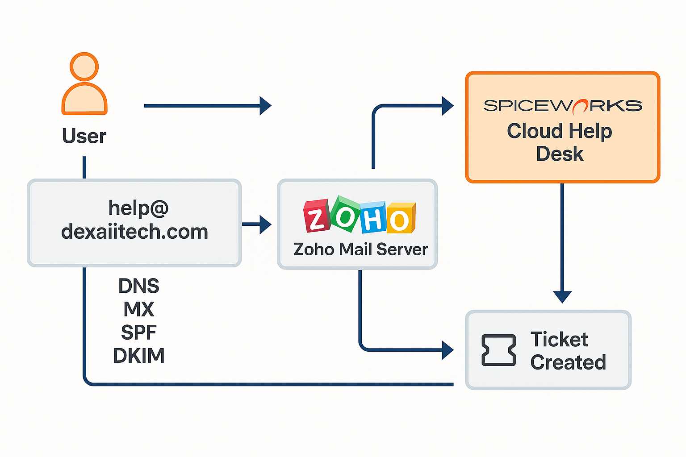

# Project Overview: Custom Domain Email and Helpdesk Integration
This portfolio project simulates a real-world IT support ticketing workflow by integrating a custom domain’s email system with a cloud-based helpdesk platform. The goal is to demonstrate an end-to-end infrastructure where support emails sent to a company’s domain are automatically converted into helpdesk tickets, and technicians can manage and respond to those tickets through the same email domain.By using real services and configurations (custom DNS records, a hosted mail server, and a SaaS helpdesk), this project mirrors the environment an IT department might set up to handle user support requests in a professional setting.

**Key Purpose:** Build a functional integration between Zoho Mail (for business email on a custom domain) and Spiceworks Cloud Help Desk (SaaS for ticket management) to emulate how an IT team would manage support queries. All email communication is handled through a verified custom email server with proper DNS configurations, ensuring that outgoing messages are authenticated (using SPF/DKIM) and delivered reliably.

## Architecture Overview
The diagram below illustrates the system architecture and workflow for this project. It shows how the custom domain’s DNS and mail server interface with the Spiceworks helpdesk platform to enable seamless email-to-ticket conversion and responses:

## Technologies Used
* **Domain and DNS Hosting (Hostinger):** Used for creating business email addresses like `help@dexaiitech.com`. Configured DNS settings for domain ownership verification and directing mail exchange to **Zoho Mail**, (TXT records, MX records). Hostinger’s DNS panel was configured with the records required for Zoho Mail and email authentication (SPF, DKIM, DMARC).
* **Zoho Mail Service:** Acts as a mail server for the custom domain such as `help@dexaiitech.com`. Zoho server hosts and support mailbox and handles sending/receiving emails. Zoho Mail’s configuration also included enabling IMAP/SMTP access for integration and setting up SPF/DKIM keys for trusted sending.
* **Spiceworks Cloud Helpdesk (SaaS Ticketing Platform):** Cloud-based IT helpdesk system used to track and manage support tickets. Spiceworks Cloud Help Desk was configured to work with the Zoho Mail account, allowing it to automatically convert incoming emails into tickets.
* **Email Protocols - IMAP & SMTP:** Industry-standard email protocols used for retrieving and sending messages. IMAP (Internet Message Access Protocol) allows Spiceworks to retrieve emails from the Zoho Mail inbox (so it can pull new support requests), and SMTP (Simple Mail Transfer Protocol) is used by Spiceworks to send outgoing messages using the Zoho Mail server.
* **Email Authentication - SPF, DKIM and DMARC:** An SPF (Sender Policy Frame work), DKIM (DomainKeys Identified Mail) and DMARC (Domain-based Message Authentication, Reporting, and Conformance) are email authentication triad. They were used to prevent spoofing of the domain's email, phishing etc.
* **Git & GitHub (Version Control):** All configurations and documentation for this project are tracked using Git, and the repository is hosted on GitHub.