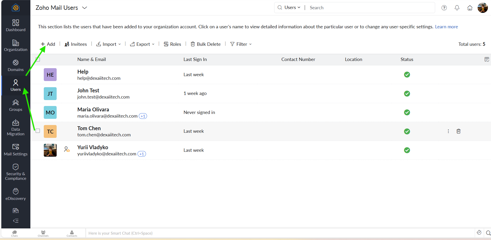
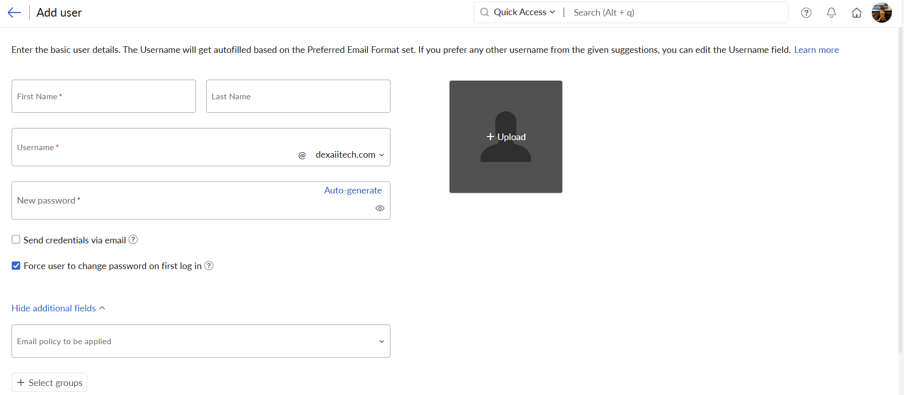
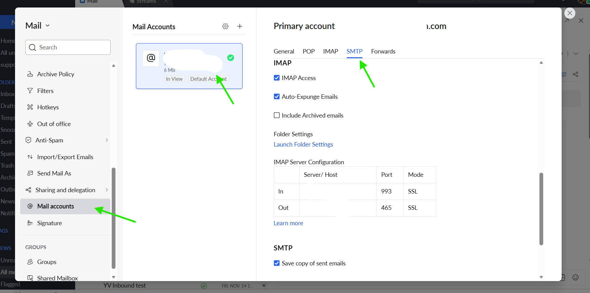

# Zoho Mail Server Setup for Custom Domain
Note: this document outlines the configuration of Zoho Mail services for the custom domain dexaiitech.com, including domain integration, mailbox creation, and email client access setup. The goal is to establish professional email accounts such as `help@dexaiitech.com` on Zoho’s servers and ensure they can send and receive mail securely. We cover verifying the domain ownership, creating a mailbox, generating an application-specific password for external email clients, configuring IMAP/SMTP settings, and enabling security measures like MFA (multi-factor authentication).

## Domain Integration and Verification
Before setting up mailboxed, you need to verify ownership of your domain.

**1.** To provide ownership of your domain to Zoho, you need to add a TXT record that Zoho provides. Verifying your domain using the TXT method involves three major steps:
* Copying the unique TXT value from Zoho Mail Admin Console.
* Adding the value as a TXT record to your domain's DNS Manager.
* Verifying the added TXT record from the Zoho Mail Admin Console.

`In addition to verification, mail exchange (MX) records for Zoho must be set up in the domain’s DNS so that incoming emails are routed to Zoho’s mail servers`

**1.** Add the following MX records to your DNS settings:

**2.** Make sure to delete all MX records not related to Zoho Mail

**3.** Verify MX record on Zoho Mail part

## Creating Mailboxes
After domain verification we can create mailboxes (user accounts) for emails, such as `help@dexaiitech.com`. And utilize it as a helpdesk/contact email. To create a new user in Zoho:

**1.** Access the Admin Console: Log in to the Zoho Mail Admin Console

**2.** Naviagate to Users: In the left-hand menu, click on Users. This will list current users and allow new additions. Click `+Add `

**3.** Add a User: Enter the user's First name and Last name. The Email address/Username and user's password. You may choose to send the credentials to an alternate email (so the user can receive their login details) and/or require a password change on first login.

**4.** Once added, the user is active. You can view the mailbox in Zoho Mail (webmail) or proceed to configure email client access for it.

## App Password Setup

## IMAP/SMTP Configuration
Configuring the communication email protocols: IMAP (Internet Message Access Protocol) AND SMTP (Simple Mail Transfer Protocol).
IMAP is used for retrieving emails from a mail server. That alloows you to download email messages from your Zoho Mail server and access them with mobile email clients 
SMTP is primarily used for sending emails. It establishes communication rules between servers to transfer messages from the sender's device to the recipient's mail server

**1.** To Enable IMAP / SMTP settings:
* Log in to your Mail server > Settings
* Navigate to Mail Accounts 

`After verifying the ownership, MX records, IMAP, SMTP - your mail server config is completed`
