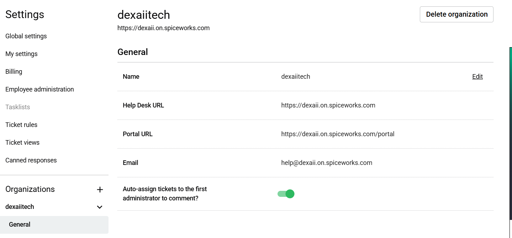
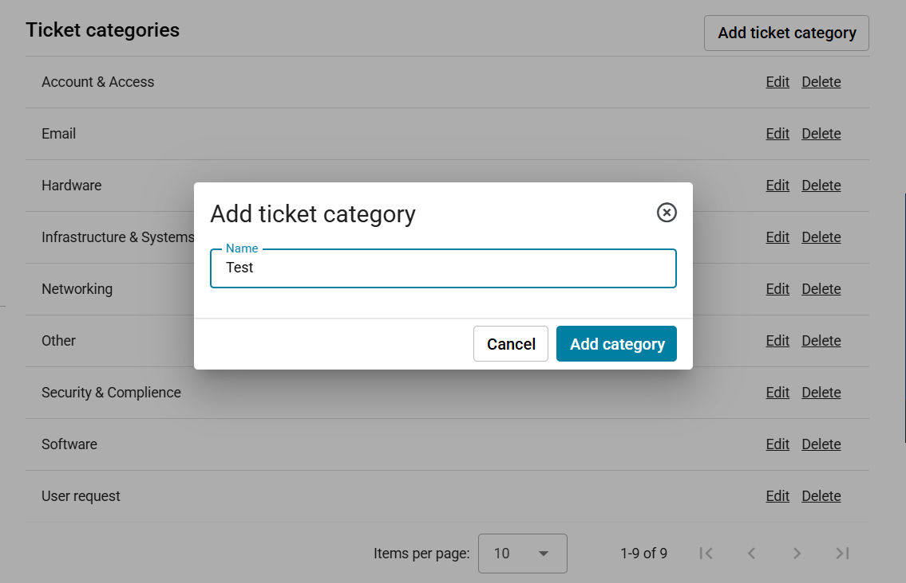
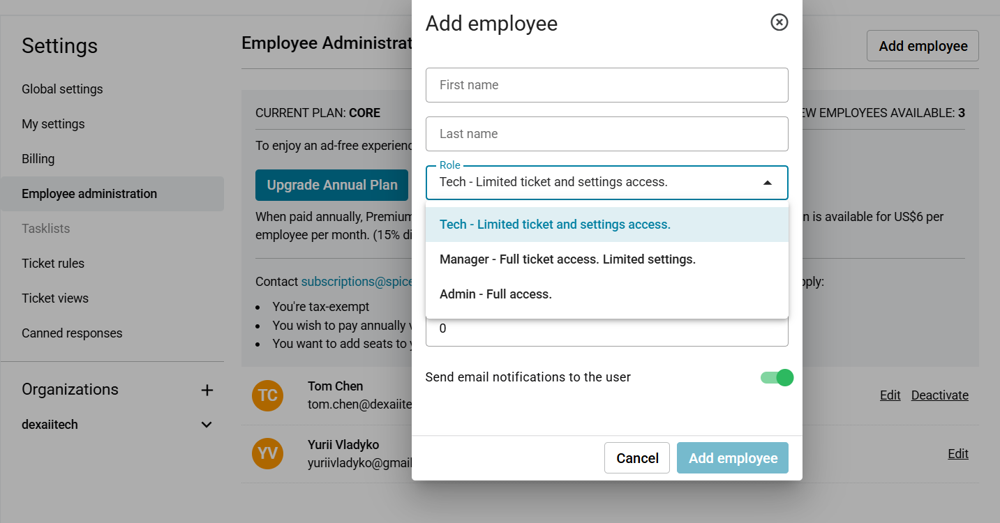
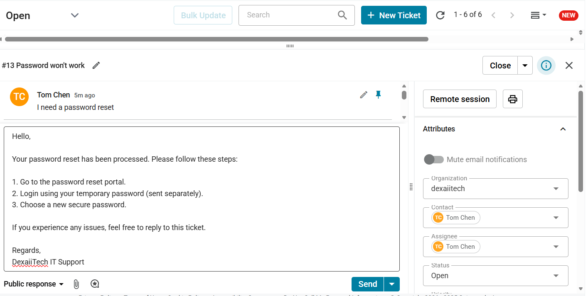
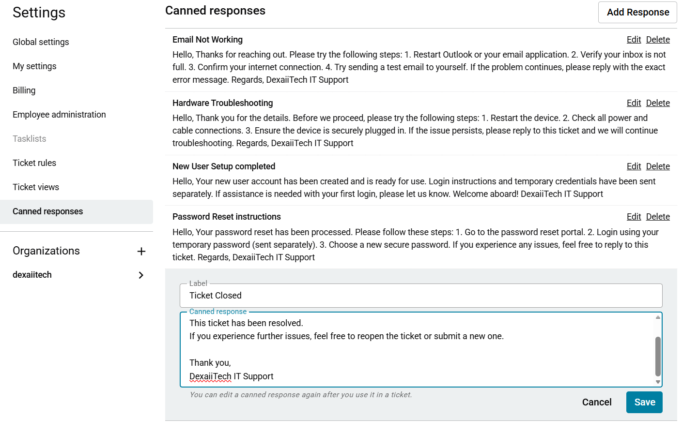
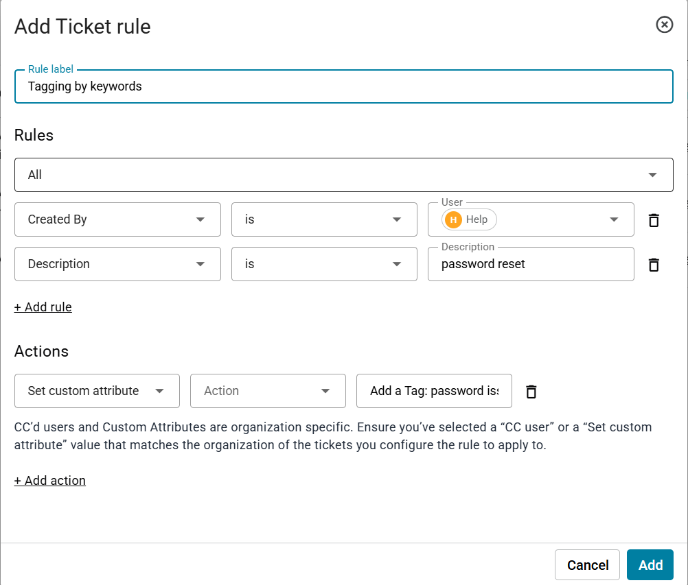
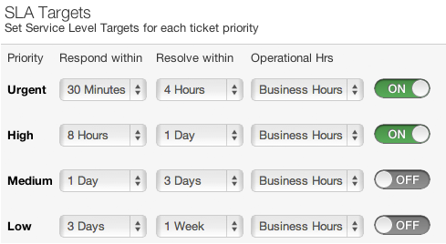
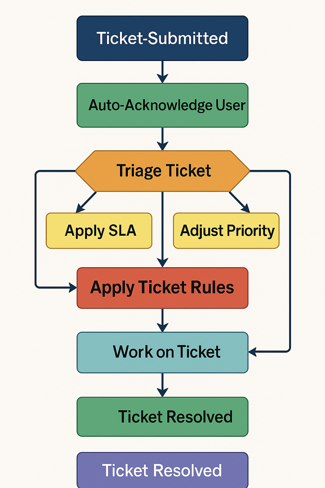

# Spiceworks Cloud Helpdesk Integration with Zoho Mail Server
Note: this document outlines the integration ( simulation **due to limitations of the free Spiceworks Cloud plan** ) between Spiceworks Cloud Helpdesk, SaaS-based ticketing system and Zoho Mail server. It details how Spiceworks Cloud was configured to provide help desk functionality, including organization settings, ticket categories, roles, ticket routing, canned responses, and ticket management rules..

## Spiceworks Cloud Help Desk Configuration
Steps taken to setup a functional support ticket system for Dexaii Tech

**1. Creating an Organization:** Organization in Spiceworks works as a workgroup - it is a container for all of your users, tickets, and rules. Also, Spiceworks handles for you custom Help Desk URL, Portal URL, and Email. that has a structure `https://<your domain>.on.spiceworks.com/portal`

* Provided Spiceworks email `help@dexaii.on.spiceworks.com`is fully functional, which means it can be used to recieve/send messages

**2. Creating Custom Ticket Categories:** Custom ticket categories were created to organize and classify incoming support requests.

` Settings > Organizations > [Your organization] > Ticket categories`
 * After creating a ticket category you can select the category during the ticket creating process. A few examples of created categories:
 * **Hardware Issues:** for problems related to physical devices, equipment, or peripheral devices
 * **Software Issues:** for any software or application-related issues
 * **Account & Access:** for issues involving user accounts and access permissions

## Roles and Ticket Assignment
Spiceworks Cloud supports multiple user roles for help desk staff, each with different permissions:
* Tech - Limited ticket and settings access
* Manager - Full ticket access. Limited settings access
* Admin - Full access

Roles and Permessions can be configured via: `Settings > Employee Administration > Add Employee ` | Spiceworks Cloud has a **limit of 5 free accounts**

## Canned Responses
Canned responses are "pre-written" email templates that allow the help desk team to quickly respond to common issues or routine updates without typing from scratch each time. For example:
* **Ticket closed:** pre-written text sent to the issuer after the ticket has been resolved
* **Acknowledgment Response:** default text displayed to the user after a ticket is submitted
* **FAQ (frequently asked questions) :** how-to instructions for common issues such as password reset

Canned responses can be configured via: `Settings > Canned responses > Add Response `. You can also dit a canned response again after you use it in a ticket.

## Ticket Creation and Workflow
With the above configurations in place, the Spiceworks Cloud Help Desk was ready to manage support requests from end-to-end. This section describes how tickets were created and processed, as well as the rules applied throughout their lifecycle:
* **Ticket Submission:** Due to the limitations of the free Spiceworks Cloud Help Desk platform, direct email-based ticket creation (via IMAP or email forwarding from Zoho Mail) is not supported. Therefore, for this project, ticket submissions were managed ticket submissions were managed using two alternative approaches:
    * **Mannual:** When a user sends a request to `help@dexaiitech.com`, the technitian copies the content of the message and creates a ticket on the Spiceworks 
    * **Direct:** Spiceworks provided a predefined email for you when you created an organization such as `help@dexaii.on.spiceworks.com`, that will forward all of the upcoming requests straight to Spiceworks Cloud Helpdesk
* **Ticket Fields:** Each ticket captured key information such as:
    * **Requester & Assignee:** The person requesting support and the staff member assigned to the ticket
    * **Subject & Description:** A brief summary and detailed description of the issue
    * **Priority:** Triage of the ticket - `Low, Medium, High`
    * **Category:** One of the custom categories we have created earlier such as: `Hardware, Software , Account & Access `
* **Auto-Assignments and Notifications:** When ticket is created:
    * The system automatically assigns the ticket to a technician based on its category (ensuring immediate ownership). If no specific assignment rule applies, the ticket is placed into a general queue.
    * The end-user (ticket requester) will automatically receive an email acknowledgment from Spiceworks Cloud that their ticket was created.
* **Ticket Status Workflow:** Ticket status, used to facilitate tracking:
    * **Open:** Every ticket starts with status `Open`, it means that ticket is still up
    * **Waiting:** he ticket has been assigned to someone and is being actively worked on
    * **Closed:** When a ticket is resolved, it is marked as Closed. Once closed, the ticket moves out of the active queue.
* **Ticket Routing Rules:** Aside from auto-assign, we have ticket rules
    * **Tag ticket based on keywords:** This is an example of ticket triage. If an incoming ticket’s description contained certain keywords ( like `password reset`), the rule would automatically assign the category `Account & Access`. And even auto-assign to a technician

     

    * **SLAs (Service Level Agreement):** Define deadlines for ticket resolution and trigger automatic follow-up emails for tickets that have exceeded their resolution time or are nearing their due time
   
    

    

   ## Conclusion
   In summary, the Spiceworks Cloud Help Desk was successfully configured as a functional ticketing system for Dexaii Tech. Despite the lack of true email automation in the free version, the setup demonstrated all key elements of the support workflow from receiving a request to closing the ticket using the Spiceworks interface.